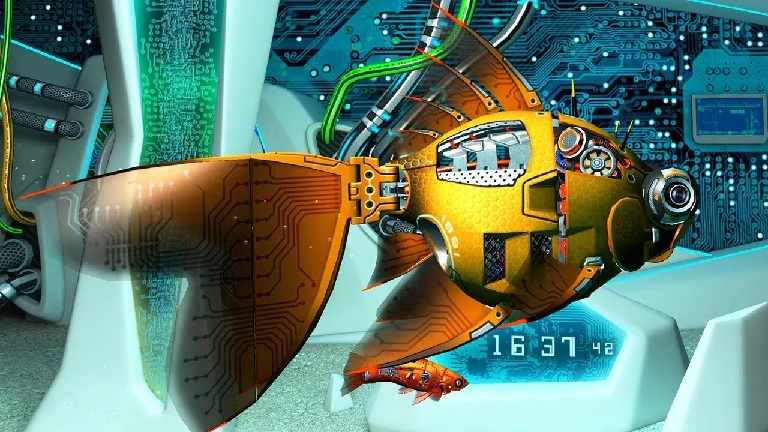

<h1 align="center">

</h1>

<strong><em>A cyberpunk fish hunts bounties from the rogue planet Mechanica!</em></strong>

This project is based on a game project originally written by Frank Dvorak and made available as part of his Udemy course titled "Learn Game Development with JavaScript". Frank's game doesn't actually have a particular name so I decided to model the title on the popular _Cyberpunk 2077_.

My focus here has been to reframe this material in a way that it could be more effectively used to train someone not just on writing game mechanics but also on doing so in JavaScript. The commit history of this repository, in particular, serves as the basis for how to incrementally add functionality.

Frank's material, as stated in his videos, has been made available freely to the public to do with as they will, which includes the assets used in the game. I have put this repository under the MIT license, which allows a similar level of permissiveness, while still crediting Frank for the original work. What you see here is a derivation for pedagogical purposes.
